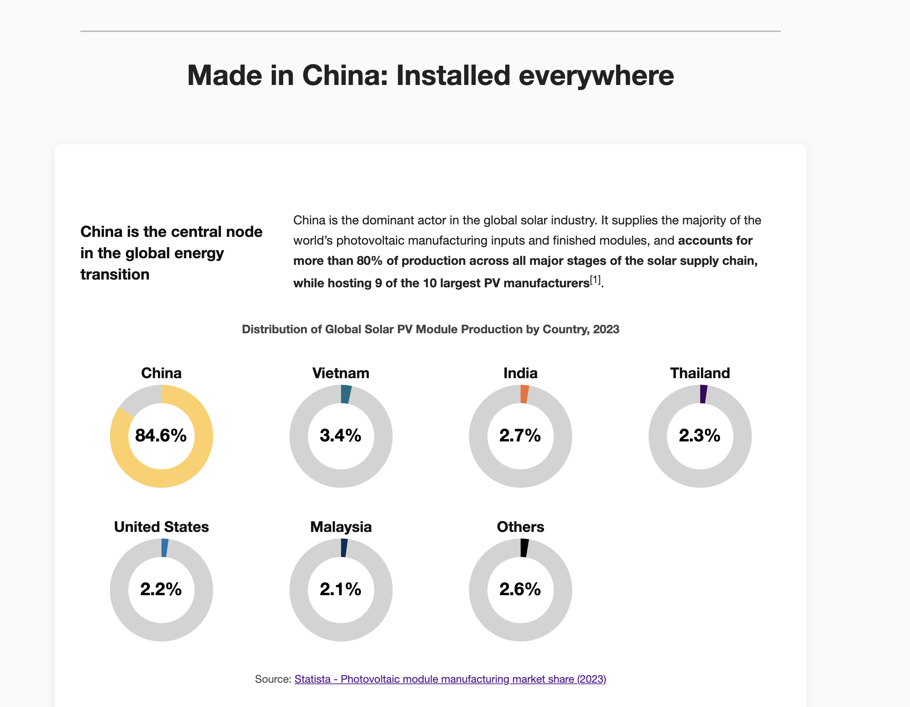
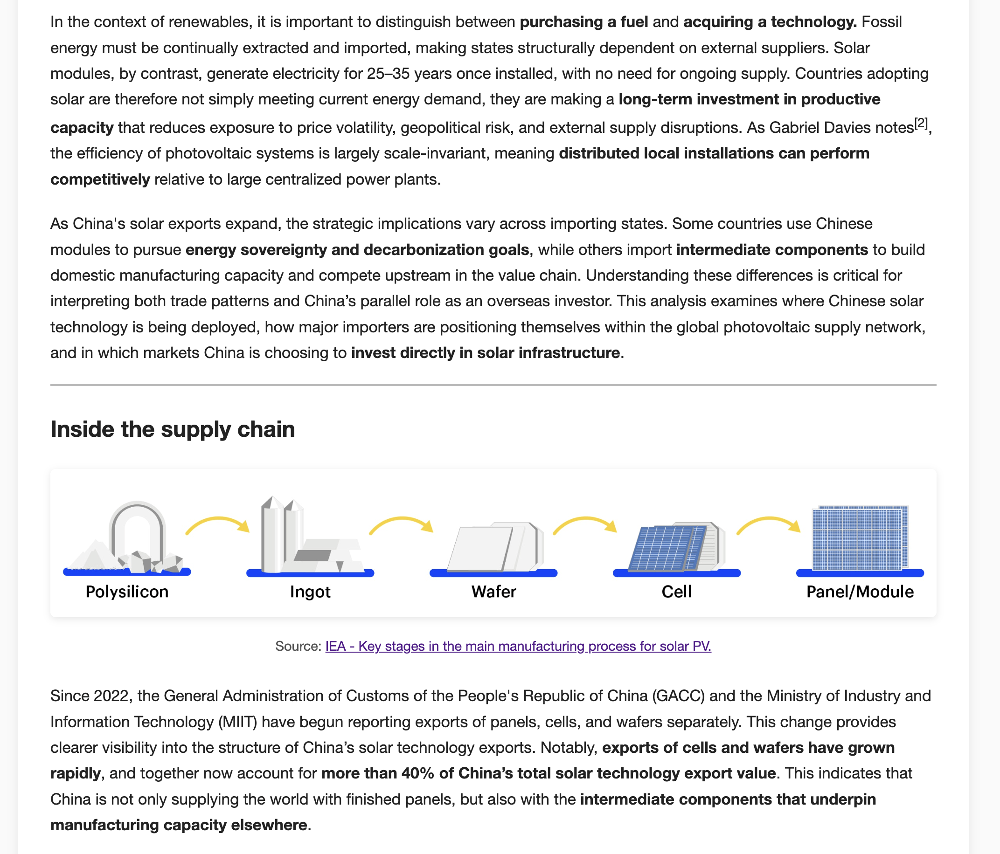
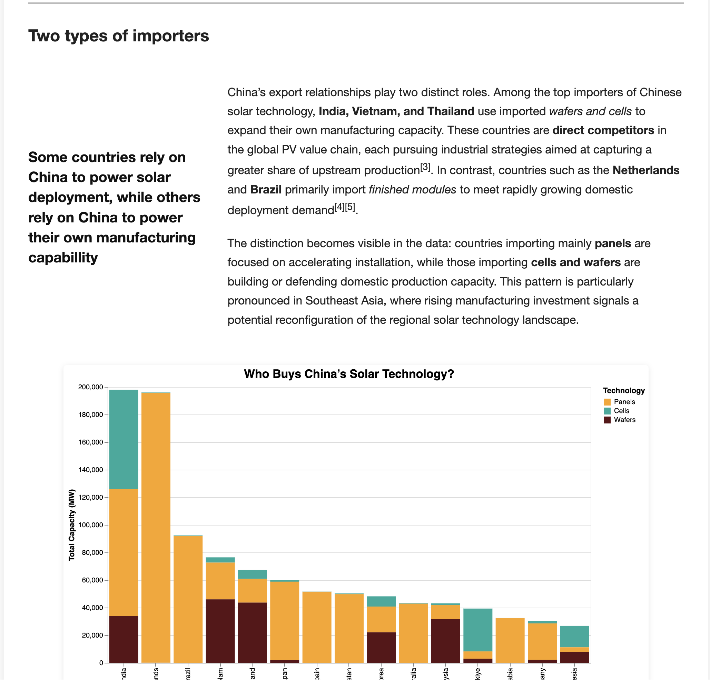
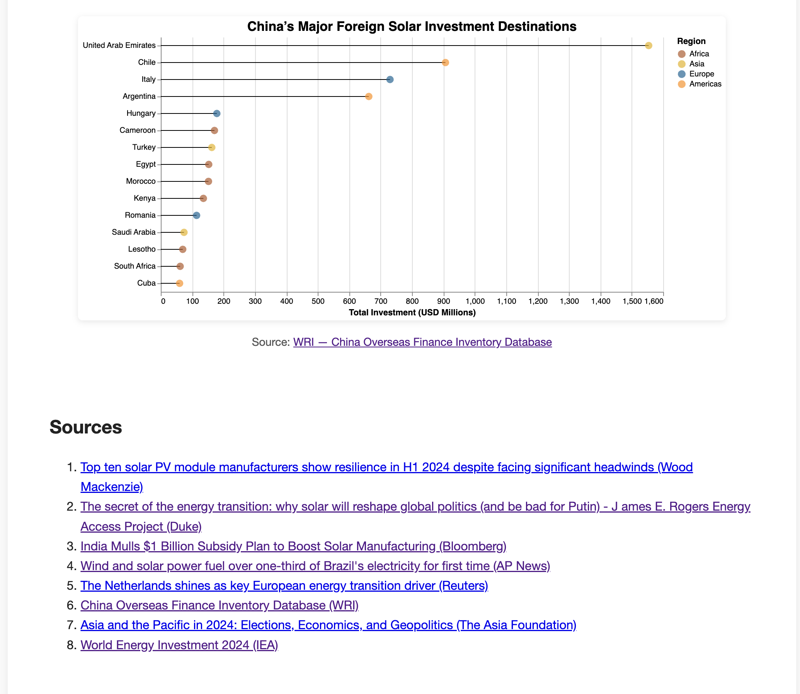

# Made in China: Installed everywhere

José María (Chema Gálvez)

## Description

China produces the vast majority of the world’s solar technology. I try to show how that technology moves across borders, where it is shipped, and where China is directly building solar infrastructure abroad,revealing the scale and reach of China’s solar energy influence in the globe.

### Screenshots of the whole html page:

## Data Sources

- WRI — [China Overseas Finance Inventory Database](https://www.statista.com/statistics/668749/regional-distribution-of-solar-pv-module-manufacturing/)
- Ember — [China’s Solar PV Exports](https://ember-energy.org/data/china-solar-exports-data/)
- Statista —  [Photovoltaic module manufacturing market share (2023)](https://www.wri.org/research/china-overseas-finance-inventory-database)